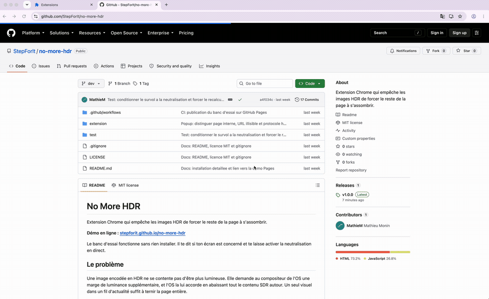

# No More HDR

Extension Chrome qui empêche les images HDR de forcer le reste de la page à s'assombrir.



**[Tester sans rien installer](https://stepforit.github.io/no-more-hdr/)** : le banc d'essai te dit si ton écran est concerné et te laisse activer la neutralisation en direct.

## Le problème

Une image encodée en HDR réclame au système une marge de luminance supplémentaire. L'OS la lui accorde, et compense en abaissant tout le contenu SDR autour. Un seul visuel dans un fil d'actualité suffit à ternir la page entière.

```
Image HDR dans la page
        │
        ▼
le navigateur réclame du headroom EDR
        │
        ▼
l'OS l'accorde et compense en assombrissant le SDR
        │
        ▼
ton texte, ton fond, tout le reste paraît terne
```

Ce n'est ni un bug ni une attaque, c'est le comportement normal d'un écran HDR. Mais quand la technique sert à faire ressortir une publication au milieu d'un fil, l'effet devient une nuisance.

## Installation

L'extension n'est pas encore publiée sur le Chrome Web Store. Elle se charge en mode développeur, ce qui prend une minute et ne présente aucun risque : le code tient en trois fichiers, tous lisibles dans `extension/`.

### 1. Télécharger

Récupérer le `.zip` de la [dernière release](https://github.com/StepForIt/no-more-hdr/releases), puis le décompresser. Le dossier obtenu contient directement `manifest.json`.

### 2. Charger dans le navigateur

| Navigateur | Adresse à ouvrir |
|---|---|
| Chrome | `chrome://extensions` |
| Edge | `edge://extensions` |
| Brave | `brave://extensions` |
| Arc, Opera, Vivaldi | `chrome://extensions` |

Puis :

1. Activer **Mode développeur**, en haut à droite sur Chrome, dans le menu de gauche sur Edge.
2. Cliquer **Charger l'extension non empaquetée**.
3. Sélectionner le **dossier** décompressé, pas le fichier `.zip`. C'est l'erreur la plus fréquente.
4. L'icône apparaît dans la barre d'outils. L'épingler la rend accessible en un clic.

> Chrome affichera un avertissement « Désactivez les extensions en mode développeur » à chaque démarrage. C'est normal pour toute extension installée hors du Store, et sans conséquence.

### 3. Vérifier que ça marche

Ouvrir la [démo](https://stepforit.github.io/no-more-hdr/) ou un fil LinkedIn, puis cliquer sur l'icône de l'extension. Le popup doit afficher le nom de domaine et l'état de neutralisation.

S'il affiche « page interne du navigateur », c'est que l'onglet actif est une page `chrome://`. L'extension n'agit que sur des pages web réelles, ouvre un vrai site et réessaie.

## Deux modèles de ciblage

L'extension embarque les deux, on bascule dans le popup.

| Mode | Comportement | Pour qui |
|---|---|---|
| **Partout** (défaut) | Neutralise sur tous les sites, sauf une liste d'exceptions | Ceux qui veulent la paix sans configurer |
| **Liste** | Neutralise uniquement sur les domaines listés | Ceux qui ne veulent agir que sur un ou deux sites |

Exceptions pré-remplies en mode Partout : `youtube.com`, `netflix.com`, `photos.google.com`, `figma.com`, `lightroom.adobe.com`, `apple.com`. Ce sont les endroits où le HDR est légitime.

Liste pré-remplie en mode Liste : `linkedin.com`, `x.com`, `instagram.com`.

Dans les deux cas, un bouton du popup ajoute ou retire le site courant de la liste pertinente.

## Révéler au survol

Activé par défaut. La page reste calme, mais l'image que l'on pointe volontairement retrouve toute son amplitude. C'est l'usage prévu par la spécification : brider en vue d'ensemble, étendre à la demande. Une photo HDR légitime reste consultable sans toucher aux réglages.

## Support navigateur

| Navigateur | Compatible |
|---|---|
| Chrome, Edge, Brave, Arc | depuis la version 136 |
| Safari | depuis Safari 26 |
| Firefox | non concerné, il ne rend pas le HDR |

Format Manifest V3, utilisable telle quelle sur tous les navigateurs Chromium.

## Limites connues

- Le tonemapping des vidéos ne passe pas toujours par le compositing CSS, l'effet peut être partiel sur certains lecteurs.
- Les images HDR dans un `iframe` cross-origin ne sont pas atteintes par la feuille de style de la page parente. Le content script s'exécute dans les frames (`all_frames`), ce qui couvre la plupart des cas.
- Les icônes ne sont pas encore fournies, la publication sur le Chrome Web Store en réclame trois tailles.

## Un souci ?

Ouvre une [issue](https://github.com/StepForIt/no-more-hdr/issues).

## Contribuer

Fonctionnement interne, banc d'essai et workflows CI : voir [DEVELOPMENT.md](DEVELOPMENT.md).

## Licence

MIT.
